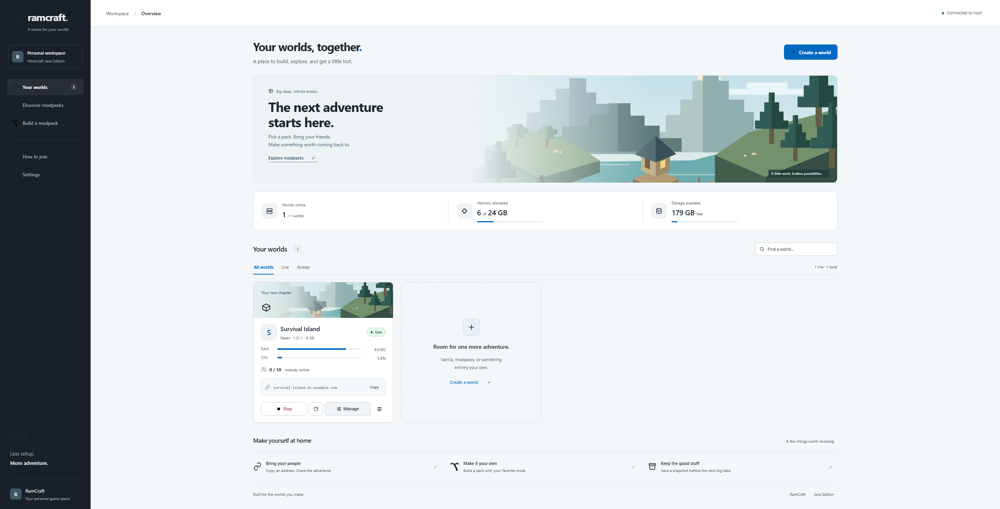

<div align="center">

# RamCraft

**Self-hosted Minecraft servers, one click each.**

Pick a modpack, drop in an adventure map, or build a pack from scratch.
RamCraft downloads it, picks the right Java, boots it, and hands you an address.



</div>

---

## ⚠️ There is no login

RamCraft has **no authentication of any kind**. Anyone who can reach the panel can create,
stop and permanently delete worlds — including their backups.

Run it on your LAN, or behind a VPN, or behind something that does auth (Authelia, Cloudflare
Access, a reverse proxy with basic auth). **Do not put the panel on the public internet.**

Forwarding port 25565 for the game itself is fine and expected — that's just Minecraft. It's
the panel on 8110 that must stay private.

---

## What it does

- **Modpacks** — search ~18,000 packs on Modrinth or FTB's curated catalogue, click, done.
- **CurseForge packs, no API key** — download the pack's Server Pack zip and drop it in.
- **Adventure maps** — drop in a world `.zip` and play it with friends.
- **Build your own pack** — pick individual mods; dependencies are resolved for you.
- **Plain servers** — Vanilla, Paper, Purpur, Fabric, Forge, NeoForge, Quilt, Spigot.
- **One address per world**, with no port to remember.
- **Install-and-play** — download a `.mrpack` that installs the right mods *and* puts the
  server in your Multiplayer list.
- Live console over RCON, player list, start/stop/restart, nightly world snapshots.

## How the addressing works

Every world is reachable at `<name>.<your-domain>` — no port, nothing to configure per world.

Minecraft sends the hostname it dialled inside its handshake, so
[`mc-router`](https://github.com/itzg/mc-router) can listen on 25565 alone and fan out to the
right world by name. RamCraft writes an `mc-router.host` label onto each container; the router
watches Docker events and wires the route the moment the container appears.

Setup is two one-time steps:

1. A wildcard **A** record — `*.mc.example.com` → your public IP, **DNS only** (no CDN proxy;
   an HTTP proxy cannot carry the Minecraft protocol).
2. Forward TCP **25565** to the machine.

Every world you create after that just works.

If your router has no NAT loopback, the bundled `ramcraft-dns` service answers that domain with
the machine's LAN address, so the same link works indoors and out. Point a device's DNS at it,
or skip it entirely if your router hairpins.

## Install and play

`Manage → Download & play` gives you a `.mrpack` that opens in the Modrinth app, PrismLauncher,
ATLauncher or MultiMC.

For a Modrinth modpack it ships **the author's own published pack** — their overrides, configs
and exact file versions — and injects one extra file: an `overrides/servers.dat` naming the
server. So when the pack finishes installing, the world is already in the player's Multiplayer
list. Install, open Minecraft, click, play.

Nothing is mirrored: the launcher downloads from Modrinth's CDN, so authors keep their counts.

## Quick start

Requires Docker and Docker Compose on a Linux host.

```bash
git clone https://github.com/MrRamGoat/ramcraft.git
cd ramcraft
cp .env.example .env    # set your LAN address, domain and docker gid
docker compose up -d --build
```

Then open `http://<host>:8110`.

`stat -c '%g' /var/run/docker.sock` gives you the `DOCKER_GID` value — mc-router runs as a
non-root user and cannot read the socket without it.

## Configuration

All of it lives in `.env`:

| Variable | What it does |
|---|---|
| `RAMCRAFT_LAN_HOST` | LAN address shown as each world's direct join address |
| `RAMCRAFT_ROUTER_DOMAIN` | Worlds are published as `<name>.<this>`. Blank = LAN only |
| `RAMCRAFT_MEM_BUDGET_GB` | RAM this machine may hand out |
| `RAMCRAFT_PORT_BASE` / `_MAX` | Direct per-world port range (25565 is the router's) |
| `DOCKER_GID` | gid owning the Docker socket |

A CurseForge API key is optional and set in the panel's Settings, not here. It only buys
installing packs by URL — the Server Pack upload route needs no key.

## How it's put together

```
├─ mc-router       :25565   routes by handshake hostname
├─ ramcraft        :8110    FastAPI panel + vanilla-JS UI
├─ ramcraft-dns    :53      optional split DNS
└─ mc-<world>              one itzg/minecraft-server per world
```

The panel talks to the Docker daemon directly; every world is one
[`itzg/minecraft-server`](https://github.com/itzg/docker-minecraft-server) container. World data
lives in `/srv/mc/<id>/data`, snapshots in `/srv/mc/_backups/`. RCON is reachable only
panel→container on the internal network, never published.

| File | |
|---|---|
| `panel/app.py` | API routes |
| `panel/servers.py` | Container lifecycle, status, snapshots, ports |
| `panel/mrpack.py` | Builds the client pack |
| `panel/nbt.py` | Writes `servers.dat` |
| `panel/rcon.py` | Minimal async RCON client |
| `panel/mcping.py` | Server List Ping, for testing routing from a shell |

## Things worth knowing

Hard-won, and easy to get wrong:

- **Java has to match the Minecraft version.** The image can't switch JVMs at runtime, so the
  tag is chosen per version: `java8` ≤1.16, `java17` to 1.20.4, `java21` above, and the newest
  for Minecraft's year-based releases (26.x). Too old and it won't boot; **too new and Fabric
  refuses to load** — a 1.21 pack on Java 25 dies with "requires version 21 of OpenJDK".
  A modpack's target version is resolved from the API at create time, never from the UI.
- **A snapshot of a running world must flush first.** The world lives in memory; archiving
  without `save-off` + `save-all flush` produces a tarball with no `level.dat` and no region
  files, and it looks like it worked. `save-on` runs in a `finally` so a failed archive never
  leaves saving disabled.
- **Container memory is heap + 2 GB.** Modded servers use well over 1 GB of non-heap. Too tight
  and the container is OOM-killed, which reads as a random crash.
- **`/proc/meminfo` reports the *host's* RAM** inside a container or LXC, so the budget has to
  be passed in explicitly.
- **Docker log chunks can be a single byte** with a TTY. Emitting each chunk as its own SSE
  event makes the console render one line per character; buffer until a newline.
- **Map sites serve pages, not files.** Pasting a Planet Minecraft link downloads HTML and the
  server dies on "Unsupported archive type: text/html". Download it and upload the zip.
- **Behind a CDN, versionless CSS/JS will be served stale against fresh HTML** — which looks
  catastrophically broken rather than merely out of date. `/` stamps a content hash onto both.
- **Never rebuild a list with `innerHTML` on a timer.** It destroys whatever the cursor is over,
  so clicks in that window hit detached nodes and silently do nothing.

## Built on

[itzg/docker-minecraft-server](https://github.com/itzg/docker-minecraft-server) ·
[itzg/mc-router](https://github.com/itzg/mc-router) · [Modrinth](https://modrinth.com) ·
[FTB](https://feed-the-beast.com) · FastAPI

## Licence

MIT — see [LICENSE](LICENSE).
